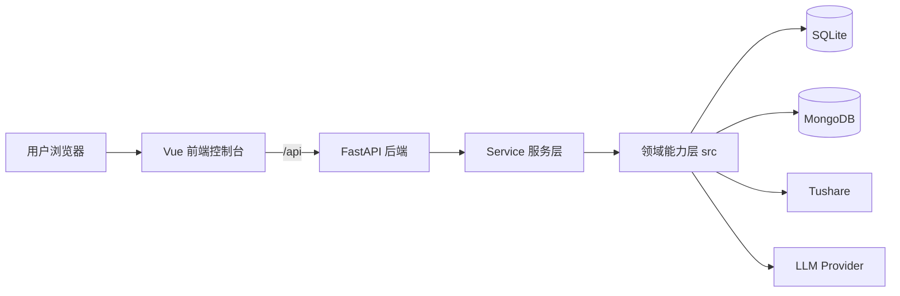

# 项目架构说明

## 1. 项目定位

这是一个面向量化研究与交易协同的多模块平台，核心目标是把以下能力放到同一个系统里：

- 行情与资讯采集
- 多 Agent 工作流
- 推荐生成与复盘
- 机器学习实验
- 回测分析
- 用户、配置与日志管理

当前主形态是：

- 后端：`FastAPI`
- 前端：`Vue 3 + Vite + Pinia + Element Plus`
- 结构化数据：`SQLite`
- 知识与复盘沉淀：`MongoDB`
- 外部行情/资讯：`Tushare`
- 模型能力：`LLM + 本地机器学习模块`

此外项目中保留了一套 `Streamlit` 页面，更多像早期原型或备用入口，不是当前主 UI。

---

## 2. 总体架构



可以把系统理解为：

`前端控制台 -> API 层 -> Service 编排层 -> src 领域能力层 -> 数据/外部服务`

---

## 3. 目录分层

### 3.1 根目录

```text
量化交易/
├─ backend/                # FastAPI 应用、路由、服务、模型
├─ frontend/               # Vue 前端
├─ src/                    # 领域能力层：agent、workflow、ml、backtest、data
├─ config/                 # 配置文件
├─ data/                   # 本地数据目录（SQLite 等）
├─ logs/                   # 日志
├─ tests/                  # 测试
├─ main.py                 # CLI/主程序入口
├─ web_app.py              # Streamlit 原型入口
└─ requirements.txt        # Python 依赖
```

### 3.2 后端分层

```text
backend/
├─ app.py                  # FastAPI 入口
├─ auth/                   # JWT、鉴权依赖
├─ routers/                # API 路由层
├─ services/               # 服务编排层
└─ models/                 # Pydantic 输出/输入模型
```

### 3.3 核心领域层

```text
src/
├─ agents/                 # 观察、推理、复盘、执行 Agent
├─ workflows/              # LangGraph 工作流
├─ data/                   # 数据访问层：SQLite、Mongo、Tushare
├─ ml/                     # 机器学习数据集、筛选、训练、预测
├─ backtest/               # 回测引擎
├─ knowledge/              # 知识库
├─ llm/                    # LLM 适配层
└─ utils/                  # 通用工具
```

---

## 4. 后端架构

## 4.1 应用入口

`backend/app.py` 负责：

- 创建 `FastAPI` 实例
- 注册所有业务路由
- 启动时初始化默认用户、默认配置、默认资讯源
- 启动新闻调度器与行情调度器
- 在生产环境下托管前端构建产物

这意味着后端既是 API 服务端，也是部署后的统一 Web 宿主。

## 4.2 路由层职责

`backend/routers/` 按业务域拆分，每个模块负责参数接收、权限校验和调用对应服务：

- `auth.py`：登录、注册、鉴权
- `users.py`：用户管理
- `settings.py`：系统配置
- `agents.py`：Agent 配置管理
- `sources.py`：资讯源管理
- `news.py`：新闻、简报、资讯同步
- `market_data.py`：行情数据中心
- `recommend.py`：推荐结果查询
- `review.py`：复盘结果查询
- `knowledge.py`：知识库查询
- `ml.py`：机器学习实验
- `backtest.py`：回测
- `trades.py`：交易记录
- `workflow.py`：观察、推理、复盘工作流触发
- `admin_logs.py`：管理员日志查看

## 4.3 服务层职责

`backend/services/` 是业务编排中心，主要包括：

- `market_data_service.py`
  - 同步 Tushare 行情
  - 聚合日线、基础指标、资金流向、龙虎榜
  - 输出行情总览
- `ml_service.py`
  - 组织机器学习实验流程
  - 串联数据集构建、特征筛选、训练、预测、结果整理
- `workflow_service.py`
  - 触发 observe / reason / review 工作流
- `news_service.py`
  - 资讯抓取、去重、入库
- `settings_service.py`
  - 系统配置与默认值维护
- `usage_log_service.py`
  - 记录回测、机器学习等实验日志
- `user_service.py`
  - 用户初始化与管理

设计上，这一层避免把算法直接堆在 router 中，符合单一职责原则。

---

## 5. 领域能力层架构

## 5.1 Agent 层

`src/agents/` 按职责分为四类：

- `observe/`
  - `event_collector.py`：生成市场事件简报
  - `tech_analyst.py`：技术指标分析
- `reason/`
  - `news_screener.py`：候选股票筛选
  - `thinking_hats.py`：多视角推理
- `review/`
  - `retrospect_agent.py`：复盘分析
- `act/`
  - `trade_recorder.py`：交易记录/OCR 相关

## 5.2 Workflow 层

`src/workflows/` 用于编排多 Agent 协作：

- `observe_flow.py`
  - 新闻/事件采集
  - 技术分析
- `reason_flow.py`
  - 候选股筛选
  - 辩论式推理
  - 最终推荐保存
- `review_flow.py`
  - 推荐结果复盘

## 5.3 数据层

`src/data/` 封装底层数据访问：

- `db/sqlite_client.py`
  - 结构化业务数据
  - 包含用户、推荐、交易、新闻、行情快照等表
- `db/mongo_client.py`
  - 热知识、冷知识、复盘简报
- `sources/tushare_api.py`
  - Tushare 封装

## 5.4 机器学习层

`src/ml/` 是当前研究型能力的核心：

- `dataset_builder.py`：构造训练集/预测集
- `selector.py`：特征筛选
- `trainer.py`：模型训练
- `predictor.py`：预测输出
- `registry.py`：特征、标签、模型定义中心

这部分已经不是展示壳，而是可执行实验链路。

## 5.5 回测层

`src/backtest/` 已拆为两类能力：

- `engine.py`
  - 推荐复盘式回测
  - 基于 `recommendations` 记录统计收益
- `portfolio_engine.py`
  - 标准信号回测
  - 支持手续费、滑点、训练窗口、Top N 持仓、模型对照
- `walk_forward.py`
  - 滚动训练/滚动验证入口

---

## 6. 数据架构

## 6.1 SQLite

SQLite 负责结构化数据，主要包括：

- 用户与权限
- 系统设置
- Agent 配置
- 新闻源与新闻文章
- 推荐记录
- 交易记录
- 复盘记录
- 日线行情
- 行情快照指标

适合频繁查询、页面展示和实验输入。

## 6.2 MongoDB

MongoDB 负责相对非结构化、持续沉淀型数据：

- 热知识库
- 冷知识库
- 复盘简报

适合作为知识沉淀层，而不是高频事务数据库。

## 6.3 外部数据源

当前主要依赖 `Tushare`：

- 股票基础信息
- 日线行情
- 基础指标
- 资金流向
- 龙虎榜
- 新闻/公告相关数据

---

## 7. 外部 UI 布局

## 7.1 UI 技术栈

主 UI 使用：

- `Vue 3`
- `Vite`
- `Pinia`
- `Element Plus`
- `Axios`
- `ECharts`

开发模式下：

- 前端运行在 `3000`
- `/api` 代理到 `http://localhost:8000`

生产模式下：

- 后端直接托管前端 `dist`

## 7.2 页面总布局

登录后的主界面是标准后台控制台布局：

```text
┌────────────────────────────────────────────────────────────┐
│ 左侧导航栏 │ 顶部页头：页面标题 / 描述 / 日期 / 用户菜单  │
│           ├───────────────────────────────────────────────┤
│           │ 主内容区：各业务页面 router-view              │
│           │ Hero / 统计卡 / 图表 / 表格 / 表单             │
└────────────────────────────────────────────────────────────┘
```

### 左侧导航栏

左侧栏固定展示品牌和菜单，按业务分组：

- 指挥台
- 交易中心
  - 推荐看板
  - 交易记录
  - 回测系统
- 分析复盘
  - 复盘分析
  - 机器学习实验
  - 行情数据中心
  - 资讯列表
  - 每日简报
  - 知识库
- 系统管理（仅管理员）
  - LLM 配置
  - Tushare 配置
  - 数据库配置
  - Agent 管理
  - 资讯源管理
  - 用户管理
  - 使用日志

### 顶部 Header

顶部页头包含：

- 当前模块标题
- 页面简介
- 日期提示
- 当前登录用户信息
- 用户下拉菜单

这部分承担“当前上下文提示”的作用。

### 主内容区

绝大部分页面遵循统一模式：

- 顶部 Hero 区
- 指标卡片区
- 主表格/图表区
- 底部结果区或辅助区

这让系统页面风格比较一致，用户切页成本低。

## 7.3 登录页布局

登录页是独立全屏页面：

- 深色背景
- 模糊彩色光斑
- 中央毛玻璃卡片
- 登录/注册切换
- 账号密码表单

这是单页入口，不复用主控制台布局。

## 7.4 视觉风格

全局主题为浅色玻璃态工作台风格：

- 背景使用渐变和径向光斑
- 卡片大量使用半透明玻璃面板
- 主色偏蓝青，辅色偏橙
- 大量圆角与柔和阴影
- 页面载入带轻量动画

整体感受更偏“研究控制台”，不是传统表格式后台。

---

## 8. 前端页面结构

## 8.1 公共页面

- `/login`：登录与注册
- `/`：指挥台 Dashboard
- `/profile`：个人中心

## 8.2 交易相关页面

- `/recommend`：推荐看板
- `/trades`：交易记录
- `/backtest`：回测系统

## 8.3 分析与研究页面

- `/review`：复盘分析
- `/ml`：机器学习实验
- `/market/data`：行情数据中心
- `/news/articles`：资讯列表
- `/news/briefs`：每日简报
- `/knowledge`：知识库

## 8.4 管理页面

- `/settings/llm`
- `/settings/tushare`
- `/settings/database`
- `/agents`
- `/agents/:id`
- `/sources`
- `/users`
- `/admin/logs`

管理员页面统一通过路由守卫做权限控制。

---

## 9. 典型调用链

## 9.1 行情中心

```text
MarketDataCenter.vue
  -> frontend/src/api/index.js
  -> /api/market-data/overview
  -> backend/services/market_data_service.py
  -> Tushare / SQLite
```

## 9.2 机器学习实验

```text
MachineLearningLab.vue
  -> /api/ml/options
  -> /api/ml/experiments/run
  -> backend/services/ml_service.py
  -> src/ml/dataset_builder.py
  -> src/ml/selector.py
  -> src/ml/trainer.py
  -> src/ml/predictor.py
  -> SQLite
```

## 9.3 回测

```text
BacktestPanel.vue
  -> /api/backtest
  -> review 模式: src/backtest/engine.py
  -> portfolio 模式: src/backtest/portfolio_engine.py
```

## 9.4 工作流

```text
Dashboard.vue
  -> /api/workflow/{type}
  -> backend/services/workflow_service.py
  -> src/workflows/*
  -> src/agents/*
```

---

## 10. 当前架构特点

### 优点

- 分层比较清晰，前后端职责边界明确
- `service` 与 `src` 层分离，便于后续扩展
- UI 已经形成统一设计语言
- 机器学习与回测已经进入可执行平台化形态
- 管理、研究、交易视图集中在一个控制台中

### 当前需要注意的点

- `Streamlit` 与 `Vue` 两套 UI 并存，长期会增加维护成本
- 部分早期 Agent 逻辑与后续机器学习/标准回测能力并行存在，需要继续收敛
- 领域能力分布在 `backend/services` 和 `src/*` 两层，后续要持续控制边界，避免编排逻辑反向侵入 router

---

## 11. 一句话总结

这是一个以 `FastAPI + Vue` 为主壳、以 `src` 作为研究与算法核心、同时集成了行情、资讯、Agent、机器学习和回测能力的量化研究控制台。

如果后续继续演进，建议主线保持为：

`数据同步 -> 特征/标签构建 -> 模型实验 -> 标准回测 -> 结果展示与复盘沉淀`
